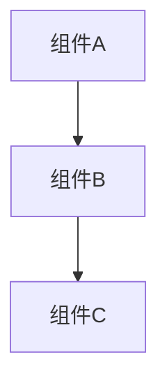

# {技术文档标题}

## 概述

{简要描述本文档的目的和范围}

---

## 目录

- [概述](#概述)
- [背景](#背景)
- [技术方案](#技术方案)
- [实现细节](#实现细节)
- [使用指南](#使用指南)
- [最佳实践](#最佳实践)
- [故障排查](#故障排查)
- [参考](#参考)

---

## 背景

{描述为什么需要这个技术方案/组件/功能}

### 业务需求
- 需求 1
- 需求 2

### 技术挑战
- 挑战 1
- 挑战 2

---

## 技术方案

### 架构设计

```
{架构图或流程图}

使用 Mermaid 图表:


### 技术选型

| 技术 | 版本 | 用途 | 理由 |
|------|------|------|------|
| {技术} | X.X | {用途} | {理由} |
| {技术} | X.X | {用途} | {理由} |

### 依赖关系

```python
# requirements.txt
package-name==X.X.X
package-name==X.X.X
```

```json
// package.json
{
  "dependencies": {
    "package-name": "X.X.X"
  }
}
```

---

## 实现细节

### 核心 API/接口

#### 1. {API/功能名称}

**端点**: `POST /api/v1/endpoint`

**请求**:
```json
{
  "field1": "value1",
  "field2": "value2"
}
```

**响应**:
```json
{
  "status": "success",
  "data": {
    "result": "value"
  }
}
```

**错误码**:
- `400`: 参数错误
- `401`: 未授权
- `500`: 服务器错误

#### 2. {API/功能名称}

（同上结构）

### 数据模型

#### {模型名称}

| 字段 | 类型 | 必需 | 说明 |
|------|------|------|------|
| field1 | string | ✅ | 说明 |
| field2 | int | ❌ | 说明 |

**Python 示例**:
```python
class ModelName(BaseModel):
    field1: str
    field2: Optional[int] = None
```

**TypeScript 示例**:
```typescript
interface ModelName {
  field1: string;
  field2?: number;
}
```

### 业务逻辑

```python
# 伪代码或示例代码
def business_logic(input: InputType) -> OutputType:
    # 步骤 1
    result = step1(input)

    # 步骤 2
    result = step2(result)

    return result
```

---

## 使用指南

### 安装配置

```bash
# 安装步骤
1. step 1
2. step 2
3. step 3
```

### 快速开始

```python
# Python 示例
from module import function

result = function(param1, param2)
print(result)
```

```typescript
// TypeScript 示例
import { function } from 'module';

const result = function(param1, param2);
console.log(result);
```

### 配置说明

```yaml
# config.yaml
setting1: value1
setting2: value2
```

| 配置项 | 类型 | 默认值 | 说明 |
|--------|------|--------|------|
| setting1 | string | "default" | 说明 |
| setting2 | int | 100 | 说明 |

---

## 最佳实践

### 性能优化

1. **{优化项}**
   - 描述
   - 示例代码

2. **{优化项}**
   - 描述
   - 示例代码

### 安全考虑

1. **{安全项}**
   - 风险描述
   - 防护措施

2. **{安全项}**
   - 风险描述
   - 防护措施

### 错误处理

```python
try:
    result = risky_operation()
except SpecificError as e:
    # 处理错误
    logger.error(f"Error: {e}")
    raise
```

---

## 故障排查

### 常见问题

#### 问题 1：{问题标题}

**症状**:
- 症状 1
- 症状 2

**原因**:
{根本原因}

**解决方案**:
```bash
# 解决步骤
1. step 1
2. step 2
```

#### 问题 2：{问题标题}

（同上结构）

### 日志调试

```python
import logging

logging.basicConfig(level=logging.DEBUG)
logger = logging.getLogger(__name__)

logger.debug("Debug message")
logger.info("Info message")
logger.error("Error message")
```

### 监控指标

| 指标 | 正常值 | 告警值 | 说明 |
|------|--------|--------|------|
| metric1 | < 100ms | > 500ms | 说明 |
| metric2 | > 95% | < 90% | 说明 |

---

## 测试

### 单元测试

```python
def test_feature():
    # Arrange
    input = create_test_input()

    # Act
    result = function_under_test(input)

    # Assert
    assert result.expected == "expected_value"
```

### 集成测试

```python
def test_integration():
    # 测试完整流程
    response = client.post("/api/endpoint", json={...})
    assert response.status_code == 200
    assert response.json()["status"] == "success"
```

---

## 参考

### 相关文档

- [规范文档](../../specs/{spec-id}/spec.md)
- [API 文档](./api.md)
- [数据库设计](./database-schema.md)

### 外部资源

- [官方文档](url)
- [最佳实践](url)
- [社区讨论](url)

---

**版本**: 1.0.0
**作者**: {作者}
**最后更新**: YYYY-MM-DD
